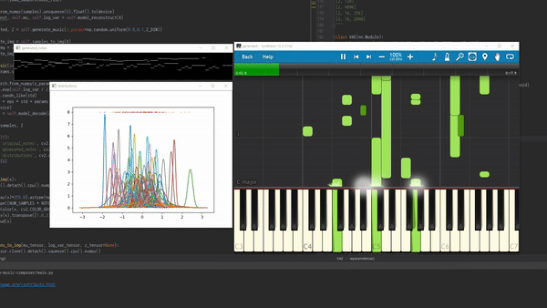

# pytorch-music-composer
Neural music composer

### Inspired by
https://www.youtube.com/watch?v=UWxfnNXlVy8&t=193s

Thanks to https://github.com/HackerPoet/Composer

### Dataset and MIDI player
I've shared resources on my cloud.

https://goe2312-my.sharepoint.com/:f:/g/personal/google7731_dongtanh_goe_go_kr/EgkDqtbc6klOtlFtOaHFABgBVs3PsKu-zQY05uqr9GO24g?e=dKurnM

### Currently on development...
